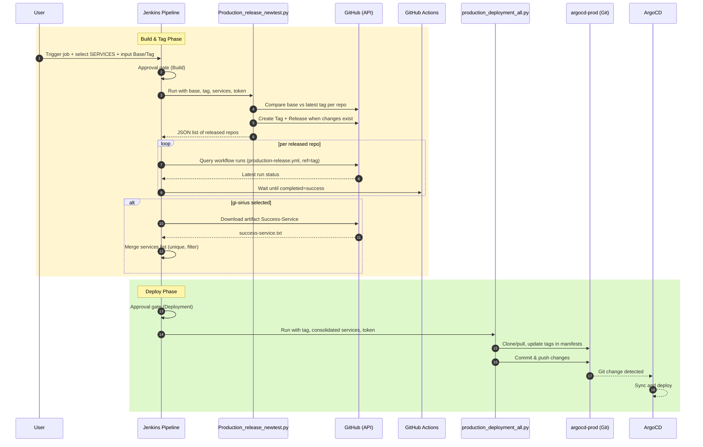

# Jenkins Production CI/CD

This repository contains a Jenkins Pipeline and supporting Python automation used to cut production releases, create GitHub tags/releases, monitor GitHub Actions, collect successful service artifacts, and drive production deployments via ArgoCD manifests.

## Overview

- **Jenkinsfile**: Orchestrates the release process end‑to‑end on the `gi-jenkins-master` node.
  - Captures base branch and release tag.
  - Lets you select one or more services/repos to include in a release.
  - Creates tags and releases in GitHub for repos with changes using `Production_release_newtest.py`.
  - Waits for associated GitHub Actions to complete, optionally downloads a summary artifact for `gi-sirius`.
  - Triggers production deployment updates via `production_deployment_all.py`.
- **Production_release_newtest.py**: For each selected repo, compares the base branch with the latest tag and, if changes exist, creates a new tag and GitHub Release with a basic changelog.
- **production_deployment_all.py**: Clones or updates the `argocd-prod` repo, scans `services/**/{*.yaml,*.yml}`, and updates container `tag:` fields to the specified release for a filtered set of services. Commits and pushes on success.
- **production_deployment.py** and **CD.py**: Variants of the deployment tag‑update flow. `CD.py` additionally supports both public/private repo cloning and targets a different repo structure.

## Prerequisites

- Jenkins with:
  - Agent label: `gi-jenkins-master` available.
  - Plugins: Extended Choice Parameter, Pipeline: Groovy, HTTP Request, Credentials Binding, JSON, and PowerShell/Bat support on Windows agents.
  - A String credential `GITHUB_TOKEN` with permissions for:
    - repo (read/write tags and releases)
    - workflow (to read workflow runs and artifacts)
- Windows build agent with:
  - Git, Python 3.10+, and PowerShell available in PATH.
- Network access to `github.com` APIs and repositories.

## Parameters

- **SERVICES** (Extended multi‑select): Comma‑separated GitHub repositories to include. Example default:
  - `owner/repo1, owner/repo2, owner/repo3, owner/repo4, owner/repo5, owner/repo6, owner/repo7, owner/repo8` and so on.
- Entered at runtime via Jenkins `input` prompts:
  - **Base Branch**: Branch from which to cut the release (e.g., `develop` or `main`).
  - **Release Tag**: A semver tag like `v1.0.0`.

## End-to-End Workflow

1. A user triggers the Jenkins job, selects SERVICES, and enters the Base Branch and Release Tag.
2. Jenkins validates approvals from allowed approvers before proceeding.
3. Jenkins checks out a local working folder and invokes `Production_release_newtest.py` with the provided inputs.
4. For each selected repo, the script compares the provided base branch vs the latest tag; if changes exist, it creates a new Git tag and a GitHub Release and prints a final JSON array of repos released.
5. Jenkins parses the script output and polls GitHub Actions for each released repo’s `production-release.yml` run for the provided tag until they succeed (or timeout/fail).
6. If `gi-sirius` is part of the selection, Jenkins downloads the `Success-Service` artifact and augments the final service list from `success-service.txt`.
7. Jenkins requests a second deployment approval.
8. Jenkins invokes `production_deployment_all.py` with the release tag and the consolidated list of services.
9. The deployment script updates `argocd-prod` manifests (image `tag:` values) only for matching services and pushes changes to the `main` branch, allowing ArgoCD to sync and deploy.



## Pipeline Stages (Jenkinsfile)

1. **Manual Input**
   - Prompts for base branch (default `develop`) and release tag (default `v1.0.0`).

2. **Select Services**
   - Echoes the services selected in `SERVICES`.

3. **Production Build Approval**
   - Approval gate. Only allowed approvers: `prayas_mittal`, `utkarsh_khandelwal`, `uttam`.

4. **Build New Release**
   - Ensures base directory `C:\production_cic` exists.
   - Clones or refreshes `owner/repo` into `C:\production_cic\repo(Jenkins_CICD)` on the provided base branch.
   - Invokes:
     ```
     python "C:\\production_cic\\repo(Jenkins-CICD)\\Production_release_newtest.py" <BASE_BRANCH> <RELEASE_TAG> <SERVICES> %GITHUB_TOKEN%
     ```
   - The Python script prints a JSON array of repos for which tags/releases were created (last line). The pipeline parses this to derive the set of repos participating in the release.

5. **Wait for GitHub Action**
   - For each repo/tag, polls `actions/workflows/production-release.yml` for runs with `ref=<RELEASE_TAG>` until completion or timeout. Fails quickly if any run concludes not successful.

6. **Download and Extract the GitHub Artifact** (conditional)
   - If `owner/repo4` is among selected services:
     - Downloads the latest successful run artifact named `Success-Service` from `production-release.yml` and extracts `success-service.txt` into `C:\production_cic`.
     - Populates the list `successServicesList` with one service per line from that artifact.

7. **Set Git Identity**
   - Sets global git user/email used for committing to deployment repos.

8. **Deployment Stage**
   - Second approval gate (same approvers).
   - Combines services detected from tagging and the optional `repo4` artifact list. Removes `owner/` prefix and excludes `repo4` itself.
   - Invokes:
     ```
     python "C:\\production_cic\\jenkins-production-cicd\\production_deployment_all.py" <RELEASE_TAG> <comma_joined_services> %GITHUB_TOKEN%
     ```
   - The script updates ArgoCD manifests and pushes changes to trigger deployment.

## Python Scripts

### Production_release_newtest.py

- Inputs: `<base_branch> <release_tag> <repos_csv> <github_token>`
- Flow:
  - For each repo: find latest tag/release, compare with base branch using GitHub compare API.
  - If changes exist, create a lightweight Git tag pointing to latest commit on the base branch and then a GitHub Release named as the tag with a basic changelog.
  - Outputs final JSON list of `owner/repo` entries for which a release was created.
- Notes:
  - Requires `requests` and `packaging` (`packaging.version.parse`).

### production_deployment_all.py

- Inputs: `<release_tag> <services_csv> <github_token>`
- Targets: `gripinvest/argocd-prod` repository on branch `main`.
- Behavior:
  - Clones or updates `argocd-prod` locally.
  - Scans `services/*/*.{yaml,yml}` files for image blocks like:
    - Generic: `repository: ghcr.io/<org>/<repo>` followed by `tag: vX.Y.Z`.
    - gi‑sirius: `repository: ghcr.io/<org>/<suborg>/<repo-name>-<suffix>` followed by `tag: vX.Y.Z`.
  - Updates only entries whose repo name (or <repo-name> suffix) is present in the provided services list.
  - Commits and pushes with message `Updated tag to <release_tag>`.

### production_deployment.py

- Similar to `production_deployment_all.py` but uses a different regex approach and has slightly different matching semantics for gi‑sirius suffix filtering.

### CD.py

- Inputs: `<release_tag> <services_csv> <github_token>`
- Clones or updates a configured repo (example shows `release-test-1`), validates `vX.Y.Z` tag format, updates YAML tags in `services/**`, and pushes changes.
- Useful as a template for deployment repos with a different layout or for dry runs.

## Run Locally (for development/testing)

Install dependencies:

```bash
python -m venv .venv
. .venv/Scripts/activate  # Windows PowerShell: .venv\Scripts\Activate.ps1
pip install requests packaging
```

Example commands:

```bash
# Create tags/releases for selected repos if changes exist
python Production_release_newtest.py develop <tag: v1.0.0> "<owner>/<repo>, <owner>/<repo-name>" YOUR_GH_TOKEN

# Update ArgoCD manifests for the services and push
python production_deployment_all.py <tag: v1.0.0> "<repo1>, <repo2>" YOUR_GH_TOKEN

# Alternate updater
python production_deployment.py <tag: v1.0.0> "<repo1-name>,<repo2-name>" YOUR_GH_TOKEN

# CD.py variant (targets different repo layout)
python CD.py v1.2.3 "<repo1>, <repo2>, <repo3>" YOUR_GH_TOKEN
```

Notes:
- Use a GitHub token with `repo` and `workflow` scopes.
- The scripts assume a Windows environment similar to the Jenkins agent; adapt paths if running elsewhere.

## Security and Approvals

- Approval gates ensure only authorized users proceed at critical steps.
- Token is passed from Jenkins credentials and should never be hard‑coded.

## Troubleshooting

- Unauthorized approver: Ensure your Jenkins user is in the allowed list in `Jenkinsfile`.
- Invalid tag format: Use semver style like `v18.0.0`.
- GitHub API 401: Check the `GITHUB_TOKEN` credential and scopes.
- No repos detected for release: Ensure your selected repos have commits ahead of the last tag on the chosen base branch.
- No files updated: Confirm the service names provided match the repo names or `<repo-name>-<suffix>` conventions in the manifests.

## Repository Layout

- `Jenkinsfile`: Release pipeline.
- `Production_release_newtest.py`: Tag and GitHub Release automation.
- `production_deployment_all.py`: ArgoCD tag updater (generic + `<repo-name>`). 
- `production_deployment.py`: Alternate ArgoCD tag updater.
- `CD.py`: Repo layout variant for updating tags.
- `README.md`: This document.
