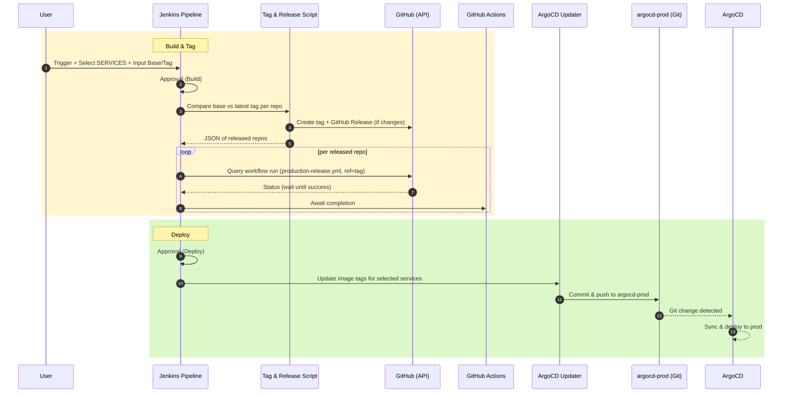

# Jenkins Production CI/CD

Fast, safe, and repeatable production releases. This job cuts tags/releases only when real changes exist, waits for GitHub Actions to pass, and updates ArgoCD manifests to deploy—guarded by explicit approvals.

## How It Flows (at a glance)

## Why it’s impactful

- Reliable: Only releases when diffs exist vs base branch.
- Observable: Blocks until GitHub Actions succeed for the new tag.
- Controlled: Dual approvals for build and production deploy.
- Automated: Updates ArgoCD manifests and pushes in one go.

## Kickstart

- Inputs: Base Branch (e.g., `develop`), Release Tag (e.g., `v1.0.0`), SERVICES list.
- Approvals: Build approval → Deploy approval.
- Result: New GitHub tag/release, successful CI runs, and production updated via ArgoCD.
